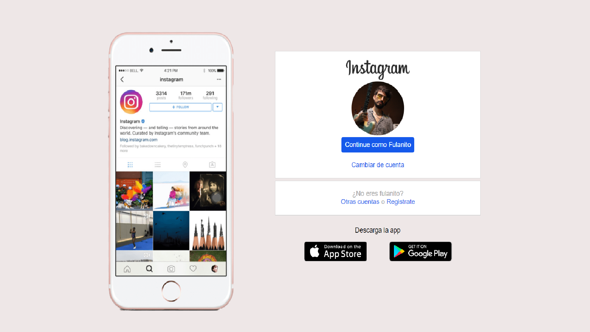

## Recriando iterface de Pagina Inicial do Instagram

Essa é uma tentativa de recriar a pagina de inicio do instagram com:
- CSS
- HTML
Foram criadas duas DIVs colocadas em colunas para a customização de cada uma.
### Primeira Div 
Foi colocada a foto do celular com a red social em tela.
### Segunda Div
Foi colocada uma div com 3 items tambem distribuidos em colunas:
- Primeiro item com logo do insta, a foto do perfil, botões de acesso à conta e trocar de conta.
- Segunda Div com botão de criar conta e botão para realizar cadastro.
- Terceira e ultima Div tem duas opção para baixar o aplicativo na loja APP Store e Google Play.

Resultado final:

